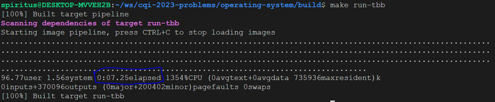

# Pré CQI 2023 - Système d'exploitation (10 points)

## Récupérer le temps d'éxécution

Lorsque que nous demandons de notez le temps après avoir fait rouler une commande, voici une image qui explique ce que vous devez vérifier.

## Étape de correction
1. Demander aux équipes de faire rouler la commande `make run-serial`. `(2 points)`
   1. Notez le temps inscrit juste avant le mot *elapsed*
2. Demander aux équipes de faire rouler la commande `make run-pthread` `(2 points)`
   1. Notez le temps inscrit juste avant le mot *elapsed*
3. Demander aux équipes de faire rouler la commande `make run-tbb` `(2 points)`
   1. Notez le temps inscrit juste avant le mot *elapsed*
4. Demander aux équipes de faire rouler le ficher `check.sh` `(2 points)`

Si le temps inscrit pour la commande `make run-serial` > `make run-pthread` > `make run-tbb` et que le fichier `check.sh` lors de l'étape 4 ne sort aucune erreur alors vous pouvez donner les points la totalité des points (10 points).

